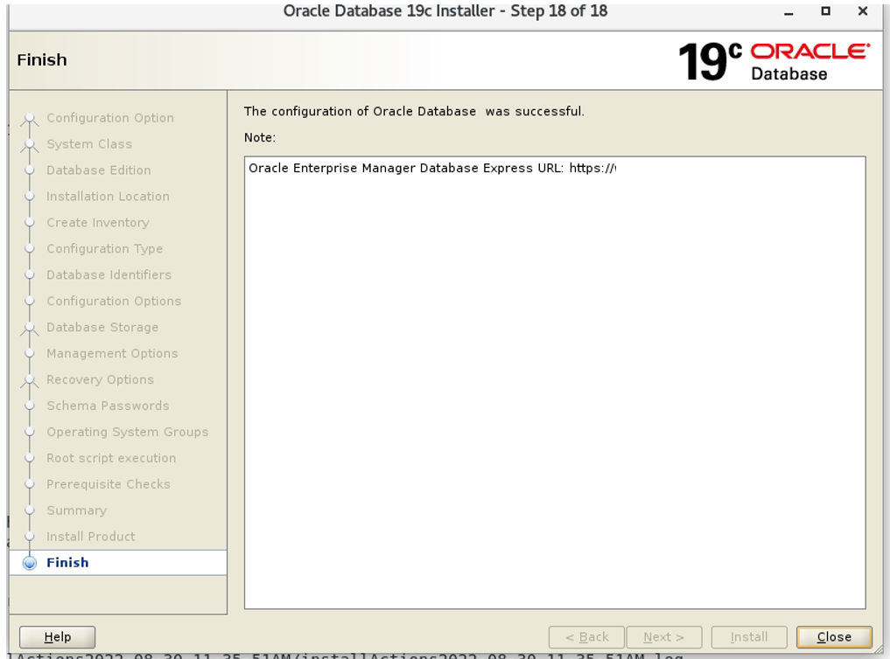

# Database Installation

**In this project, I successfully designed and configured Oracle Database on Oracle Cloud Infrastructure (OCI).**

🔹 **Key Achievements**

✅ Successfully installed and configured Oracle Database 12c, 19c on OCI.

✅ Applied security patches and implemented secure access controls.

🔹 **Installation Process**

1️⃣ **Pre-Installation Planning**

  -- Conducted system requirements analysis for the database, including storage, memory, and CPU requirements.

2️⃣ **Installing Oracle Database on OCI**

  -- Provisioned OCI Compute instances for configuring Oracle Database.
  
  -- Installed Oracle Linux 7.x/8.x on the OCI instance (if not pre-installed).
  
  -- Configured the required system settings (swaps, ulimits, etc.) for Oracle installation.
  
  -- Set up listeners and TNS for database connectivity.

