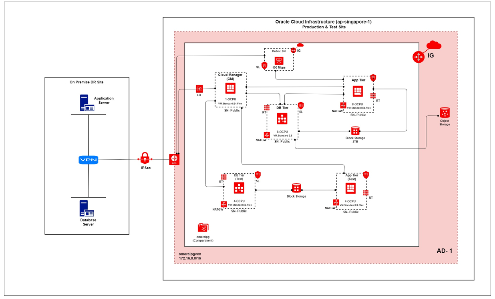

# Disaster Recovery (DR) Solutions

**In this project, I designed and implemented a Disaster Recovery (DR) Solution using Oracle Cloud Infrastructure (OCI) for several customers to ensure business continuity and high availability for mission-critical applications and data. The solution leverages automated backups, data replication, and failover strategies to recover from any potential disruptions, minimizing downtime and data loss.**

🔹 **Key Achievements**

✅ Successfully implemented DR for mission-critical workloads.

✅ Configured OCI Block Volumes, Object Storage, and File Storage for backups.

✅ Integrated Oracle Data Guard for database replication and failover(different for version).

✅ Set up automated backups for both application and database layers(scripted and scheduled in cronjob).

✅ Designed and validated DR failover procedures to ensure minimal downtime.

✅ Achieved business continuity with geographically distributed DR sites.

🔹 **Implementation Details**

1️⃣ **Assessment & Planning**

	-- Evaluated business requirements and identified critical applications, databases, and infrastructure components to be included in the DR plan.
 
	-- Designed a disaster recovery architecture that aligns with OCI best practices and supports high availability.

2️⃣ **Backup Strategy Configuration**

	-- Configured OCI Block Volumes for database and application backups.
 
	-- Implemented Oracle RMAN for automated database backups and cross-region replication.

3️⃣ **Data Replication & Database Failover**

	-- Set up Oracle Data Guard for real-time database replication across multiple OCI regions.
 
	-- Configured synchronous and asynchronous replication to ensure data consistency across sites.
 
	-- Tested automatic failover scenarios to validate high availability during a disaster.
 
4️⃣ **Failover Testing & Recovery Validation**

	-- Conducted regular DR failover drills to validate the recovery process and response times.
 
	-- Ensured the seamless failover of applications to the secondary site without service interruptions.
 
	-- Created manual with detailed instructions on how to trigger failover and failback operations.
