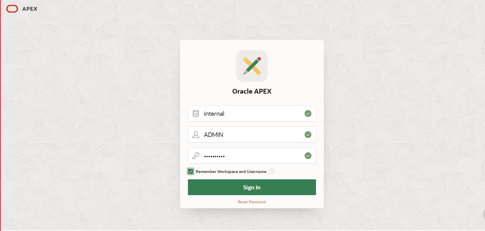
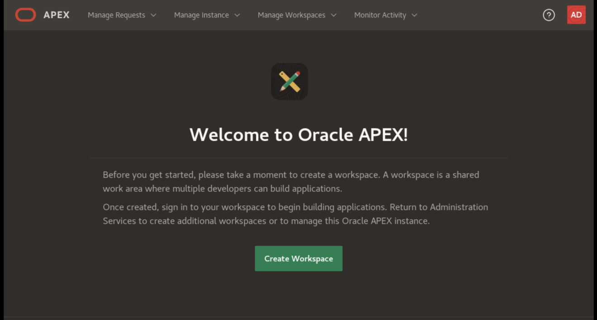

# Oracle APEX & ORDS Installation

**I've successfully installed and configured Oracle APEX (Application Express) and Oracle REST Data Services (ORDS) to enable rapid application development and web service integration on Oracle Cloud Infrastructure (OCI). The goal was to create a development environment for building modern web applications that interact with the Oracle Database and can be accessed through RESTful APIs. Also I have done with the web version like Tomcat.**

🔹 **Key Achievements**

✅ Installed and configured Oracle APEX and Oracle REST Data Services (ORDS) with different versions.

✅ Integrated Oracle APEX with Oracle Cloud Databases for seamless application hosting and management.

✅ Configured SSL certificates for secure access to the web applications and APIs.

🔹 **Installation Process**

1️⃣ **Prerequisites and Planning**

  -- Oracle Database: Ensured that an Oracle Database instance is running on Oracle Cloud Infrastructure (OCI).
 
  -- OCI Compute Instance: Provisioned an OCI Compute instance (VM) that will host the ORDS and APEX configuration.

  -- Web Server: Installed Apache HTTP Server or Oracle HTTP Server (OHS) to handle incoming web requests for Oracle APEX and ORDS.
  
2️⃣ **Installing Oracle APEX**

  -- Downloaded the latest version of Oracle APEX from the official Oracle website.
  
  -- Unzipped the installation files on the OCI Compute instance.

  -- Logged into SQL*Plus as SYSDBA user and ran the APEX installation script to install APEX into the Oracle Database.

  -- Configured HTTP listener for APEX using Oracle REST Data Services (ORDS).

  -- Enabled and configured the APEX Instance Administration schema for managing applications.
  
3️⃣ **Installing Oracle REST Data Services (ORDS)**

  -- Downloaded the latest version of Oracle REST Data Services (ORDS) from Oracle’s website.

  -- Installed ORDS on the OCI Compute instance.

  -- Configured Oracle Database connection details in ORDS to link it to the Oracle Database.

