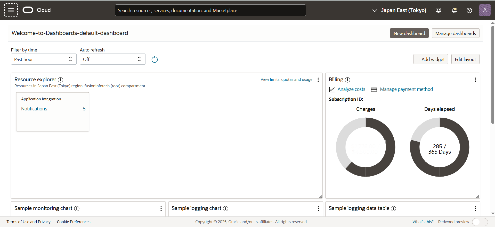

# Oracle Cloud Account Creation

✅ Created a new Oracle Cloud Free Tier account.

✅ Configured Multi-Factor Authentication (MFA) for enhanced security.

✅ Set up billing and cost tracking to monitor usage.

✅ Configured IAM (Identity and Access Management) roles for secure access control.

✅ Successfully accessed and navigated the OCI Console to manage cloud services.

